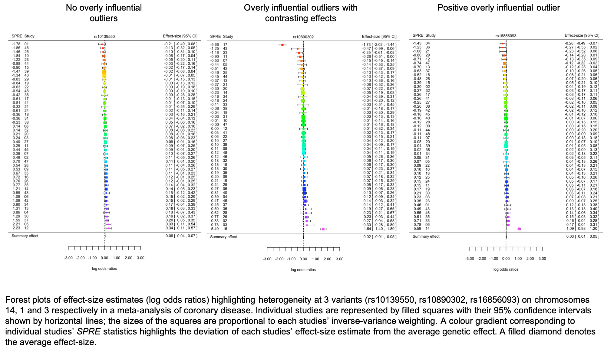

[](https://travis-ci.org/magosil86/getspres)
[](https://raw.githubusercontent.com/magosil86/getspres/master/LICENSE)
[](https://github.com/magosil86/getspres/issues)
[](https://cran.r-project.org/package=getspres)
[](http://cran.rstudio.com/web/packages/getspres/index.html) 
<!-- []()  -->


## _getspres_ : _SPRE_ Statistics for Exploring Heterogeneity in Meta-Analysis


One useful way of identifying overly influential outlier studies in meta-analyses and 
their direction of effect is through the calculation of _SPRE_ (standardised predicted random-effects) 
statistics. _SPRE_ statistics are precision-weighted residuals that capture the direction
and extent to which genetic effects of different studies in a meta-analysis deviate from
the average genetic effect at a variant of interest. Positive outliers have the potential 
to inflate average genetic effects in a meta-analysis whilst negative outliers 
might lower or change the direction of effect.


**_getspres_** facilitates calculation of _SPRE_ statistics in R and provides forest plots 
that show corresponding _SPRE_ statistic values for participating studies in meta-analyses. 

An advantage of using the **_getspres_** package is that it provides a quantitative and 
visual view of heterogeneity at individual genetic variants in meta-analyses.

**Zoom in on the web browser to get a better view of the images**
# []() 


### How are spres calculated?

Consider a GWAS meta-analysis (P), with S GWAS studies (s = 1,2,3,⋯,S) and 
V independently associated variants (v = 1,2,3,⋯,V). Data for each variant are analyzed using a 
random-effects model to estimate the average genetic effect and partition the variability 
in study effect-sizes into random sampling and heterogeneity components. Then, the standardized 
predicted random effect (SPRE) for the vth variant in the sth study is calculated as:

# []() 

See the following references for more details:

Harbord, R. M., & Higgins, J. P. T. (2008). Meta-regression in Stata. Stata Journal 8: 493–519.

Magosi LE, Goel A, Hopewell JC, Farrall M, on behalf of the CARDIoGRAMplusC4D Consortium (2017) 
Identifying systematic heterogeneity patterns in genetic association meta-analysis studies. 
PLoS Genet 13(5): e1006755. https://doi.org/10.1371/journal.pgen.1006755.

---

### Installation

```{r}
# To install the release version from CRAN:
install.packages("getspres")

# Load libraries
library(getspres)  # for calculating SPRE statistics


# To install the development version from GitHub:

# install devtools
install.packages("devtools")

# install getspres
library(devtools)
devtools::install_github("magosil86/getspres")

# Load libraries
library(getspres)  # for calculating SPRE statistics
```

### Usage

Load the getspres package in your current R session, and try some examples in the [example workflow](https://htmlpreview.github.io/?https://github.com/magosil86/getspres/blob/master/vignettes/getspres-tutorial.html)

```{r}
# Load libraries
library(getspres)  # for calculating SPRE statistics
```
For an overview of available functions in **_getspres_**, type `?getspres` and `?plotspres` at the R prompt.


### Getting help

To suggest a new feature, report a bug or ask for help, please provide a reproducible example 
at: https://github.com/magosil86/getspres/issues. Also see [reprex](https://reprex.tidyverse.org/) 
to learn more about generating reproducible examples.


### References

Lerato E Magosi, Anuj Goel, Jemma C Hopewell, Martin Farrall, on behalf of the CARDIoGRAMplusC4D 
Consortium, Identifying small-effect genetic associations overlooked by the conventional 
fixed-effect model in a large-scale meta-analysis of coronary artery disease, Bioinformatics, , btz590, 
https://doi-org.ezp-prod1.hul.harvard.edu/10.1093/bioinformatics/btz590

Harbord, R. M., & Higgins, J. P. T. (2008). Meta-regression in Stata. Stata Journal 8: 493–519.

Wolfgang Viechtbauer (2010). Conducting meta-analyses in R with the
metafor package. Journal of Statistical Software, 36(3), 1-48. URL
http://www.jstatsoft.org/v36/i03/.

Magosi LE, Goel A, Hopewell JC, Farrall M, on behalf of the CARDIoGRAMplusC4D Consortium (2017) 
Identifying systematic heterogeneity patterns in genetic association meta-analysis studies. 
PLoS Genet 13(5): e1006755. https://doi.org/10.1371/journal.pgen.1006755.


### Authors

<a >Lerato E. Magosi</a> <small class="roles"> </small> <a  href="http://orcid.org/0000-0002-3388-9892" target="orcid.widget"></a>, <a >Jemma C. Hopewell</a> <small class="roles"> </small> and 
<a >Martin Farrall</a> <small class="roles"> </small> <a href="http://orcid.org/0000-0003-4564-2165" target="orcid.widget"></a>


### Maintainer

Lerato E. Magosi lmagosi@well.ox.ac.uk or magosil86@gmail.com

### Citation

Lerato E Magosi, Jemma C Hopewell and Martin Farrall (2018). getspres:
SPRE Statistics for Exploring Heterogeneity in Meta-Analysis. R
package version 0.1.0.9000. https://magosil86.github.io/getspres/
  
### Code of conduct

Contributions are welcome. Please observe the [Contributor Code of Conduct](https://github.com/magosil86/getspres/blob/master/CONDUCT.md) when participating in this project.

### License

[MIT](https://opensource.org/licenses/mit-license.php) + file [License](https://github.com/magosil86/getspres/blob/master/LICENSE).
