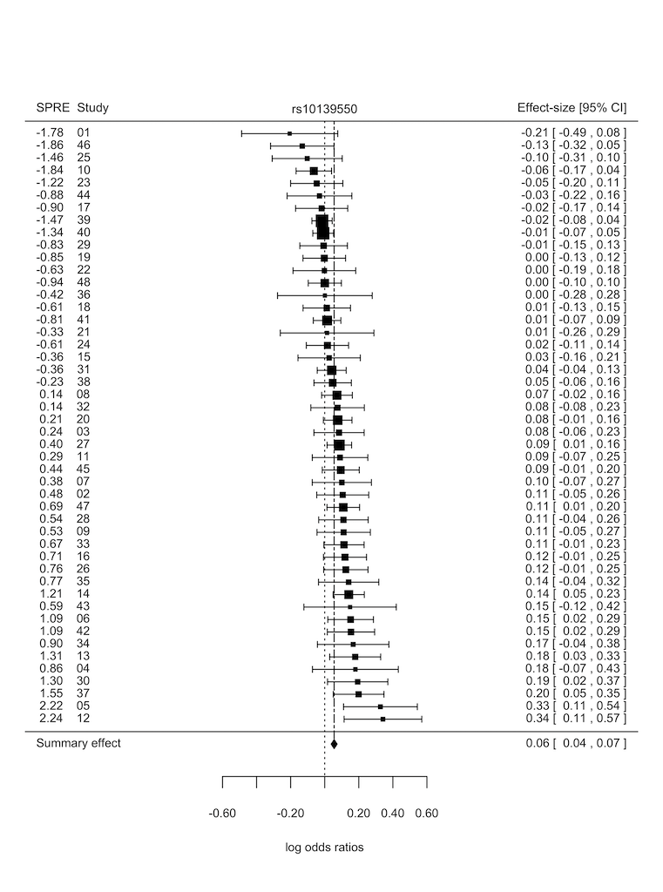
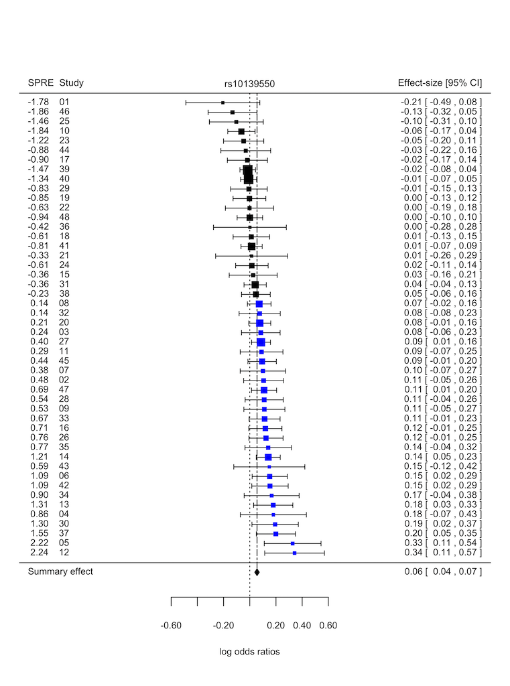
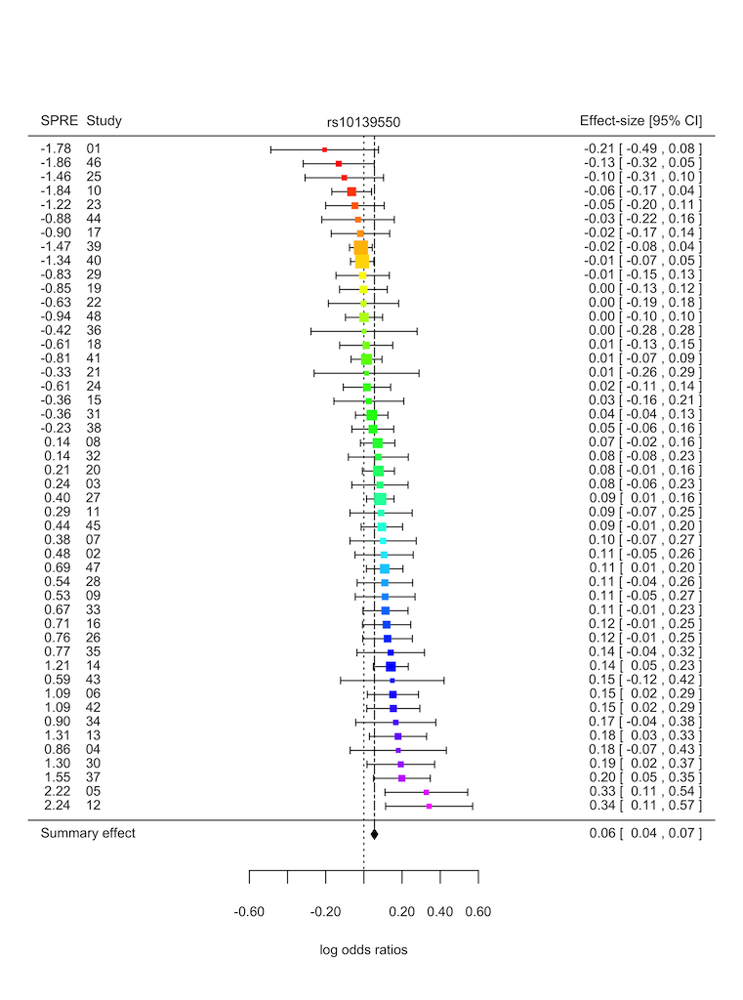
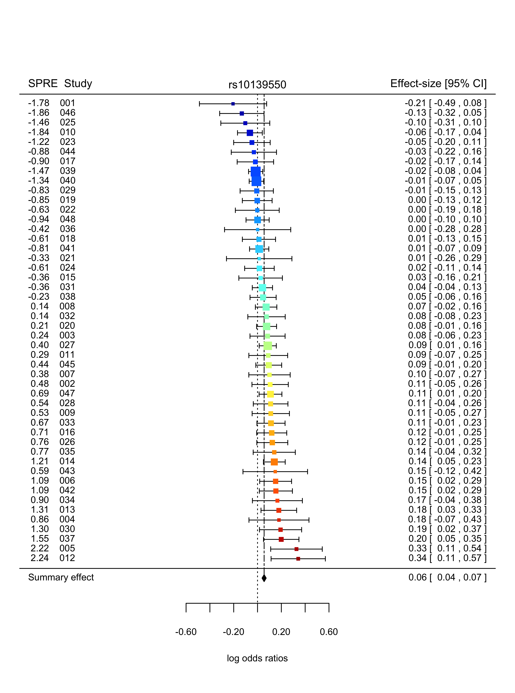
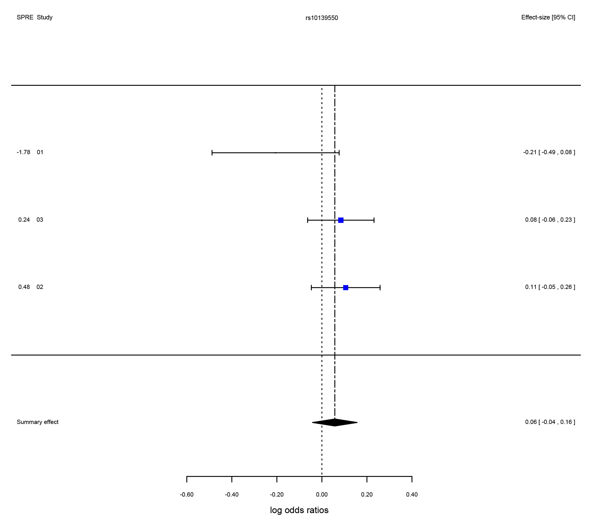
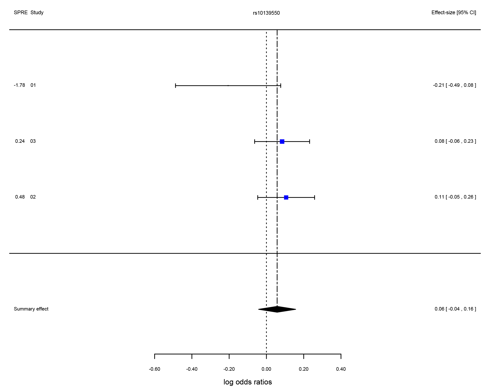

---

```{r, echo = FALSE, message = FALSE}
# Global options
knitr::opts_chunk$set(collapse = T, comment = "#>", fig.path="fig/")
options(tibble.print_min = 4L, tibble.print_max = 4L)
```

## Tutorial Goals

1. Outline importance of identifying overly influential outliers in meta-analysis.

1. Demonstrate how the getspres R package can be used to identify outlier studies showing extreme effects in meta-analyses.


## It's important to check for potential outliers when performing meta-analysis, here's why

* The presence of outlier studies showing outsized effects in a meta-analysis might contribute
  to inflated genetic signals yielding false positive or negative genetic associations. 

* Heterogeneity sources which might contribute to overly influential outliers in genetic 
  association meta-analysis include: population structure and genotyping error.


## Two popular approaches for identifying overly influential outliers

* Outlier studies showing extreme effects can be identified quantitatively through the 
  calculation of _SPRE_ statistics (standardised predicted random-effects) or visually via forest plots.
  
* Forest plots illustrate the distribution of genetic effect estimates reported by studies in a meta-analysis. 

* SPRE statistics are precision-weighted residuals that summarise the direction and extent with which
  genetic effects reported by participating studies in a meta-analysis deviate from the summary or average genetic effect.
  Another term commonly used when referring to _SPRE_ statistics is internally studentized residuals. 
  Detailed statistical theory on _SPRE_ statistics can obtained from the following references:

  Harbord, R. M., & Higgins, J. P. T. (2008). Meta-regression in Stata. Stata Journal 8: 493–519.

  Magosi LE, Goel A, Hopewell JC, Farrall M, on behalf of the CARDIoGRAMplusC4D Consortium (2017) 
  Identifying systematic heterogeneity patterns in genetic association meta-analysis studies. 
  PLoS Genet 13(5): e1006755. https://doi.org/10.1371/journal.pgen.1006755.
  
  
## The getspres R package: A two for one bargain in outlier diagnostics!

* The getspres R package combines calculation of _SPRE_ statistics and generation of 
  forest plots in a single tool, making it easier to identify overly influential outliers
  with effects that differ substantially from those reported by other studies in a meta-analysis. 

* The getspres package comprises 2 functions:

  * getspres: calculates _SPRE_ statistics
  * plotspres: generates forest plots showing _SPRE_ statistics


## Let's take a look at some examples:
  
### Data: heartgenes214

To explore heterogeneity with the getspres R package, we shall use the `heartgenes214` dataset.

The `heartgenes214` dataset is a case-control meta-analysis of coronary artery disease. 

The `heartgenes214` dataset is documented in `?heartgenes214'. It comprises summary data 
(effect-sizes and corresponding standard errors) for 48 studies (68,801 cases and 123,504 controls), 
at 214 lead variants independently associated with coronary artery disease (_P_ < 0.00005, FDR < 5%). 
Of the 214 lead variants, 44 are genome-wide significant (_P_ < 5e-08). The meta-analysis 
dataset is based on individuals from six ancestry groups, namely: African American, 
Hispanic American, East Asian, South Asian, Middle Eastern and European. 

#### The data was sourced from:

Magosi LE, Goel A, Hopewell JC, Farrall M, on behalf of the CARDIoGRAMplusC4D Consortium (2017) 
Identifying systematic heterogeneity patterns in genetic association meta-analysis studies. 
PLoS Genet 13(5): e1006755. [https://doi.org/10.1371/journal.pgen.1006755](https://doi.org/10.1371/journal.pgen.1006755).


```

# Load libraries and inspect data  ------------------------------------

library(getspres)


# Exploring heterogeneity at 3 variants in heartgenes214

head(heartgenes214)

str(heartgenes214)

heartgenes3 <- subset(heartgenes214, 
    variants %in% c("rs10139550", "rs10168194", "rs11191416")) 


# Exploring the `getspres` and `plotspres` functions

?getspres

?plotspres


# Calculating SPRE statistics  -----------------------------------

getspres_results <- getspres(beta_in = heartgenes3$beta_flipped, 
                               se_in = heartgenes3$gcse, 
                      study_names_in = heartgenes3$studies, 
                    variant_names_in = heartgenes3$variants)


# Explore results generated by the getspres function
str(getspres_results)

# Retrieve number of studies and variants
getspres_results$number_variants
getspres_results$number_studies

# Retrieve SPRE dataset
df_spres <- getspres_results$spre_dataset
head(df_spres)

# Extract SPREs from SPRE dataset
head(spres <- df_spres[, "spre"])


# Exploring available options in the getspres function:

#     1. Estimate heterogeneity using "REML", default is "DL"
#     2. Calculate SPRE statistics verbosely

getspres_results <- getspres(beta_in = heartgenes3$beta_flipped, 
							   se_in = heartgenes3$gcse, 
				      study_names_in = heartgenes3$studies, 
				    variant_names_in = heartgenes3$variants,
					     tau2_method = "REML",
				      verbose_output = TRUE)


# Generating forest plots  ---------------------------------------

# Forest plot with default settings
plotspres_res <- plotspres(beta_in = df_spres$beta, 
                             se_in = df_spres$se, 
                    study_names_in = as.character(df_spres$study_names), 
                  variant_names_in = as.character(df_spres$variant_names),
                          spres_in = df_spres$spre)

# Explore results generated by the plotspres function

# Retrieve number of studies and variants
plotspres_res$number_variants
plotspres_res$number_studies

# Retrieve fixed and random-effects meta-analysis results
fixed_effect_res <- plotspres_res$fixed_effect_results
random_effects_res <- plotspres_res$random_effects_results

# Retrieve dataset that was used to generate forest plots
df_plotspres <- plotspres_res$spre_forestplot_dataset


# Retrieve more detailed meta-analysis output
str(plotspres_res)

```



```

# Explore available options for plotspres forest plots: 
#   1. Colorize study-effect estimates according to SPRE statistic values
#   2. Label studies by study number instead of study names
#   3. Format study labels (useful when using study numbers as study labels)
#   4. Change text size
#   5. Adjust x and y axes limits
#   6. Change method used to estimate amount of heterogeneity from "DL" to "REML"
#   7. Run verbosely to show intermediate results
#   8. Adjust label (i.e. column header) positions
#   9. Save plot as a tiff file (useful when generating multiple plots)

# Colorize study-effect estimates according to SPRE statistic values

# Use a dual colour palette for observed study effects so that study effect estimates 
#   with negative SPRE statistics are coloured differently from those with positive 
#   SPRE statistics.
plotspres_res <- plotspres(beta_in = df_spres$beta, 
                             se_in = df_spres$se, 
                    study_names_in = as.character(df_spres$study_names), 
                  variant_names_in = as.character(df_spres$variant_names),
                          spres_in = df_spres$spre,
               spre_colour_palette = c("dual_colour", c("blue","black")))


```



```


# Use a multi-colour palette for observed study effects so that study effects estimates
#   are colored in a gradient according to SPRE statistic values.
#   Available multi-colour palettes:
#
#       gr_devices_palettes: "rainbow", "cm.colors", "topo.colors", "terrain.colors" 
#                            and "heat.colors" 
#
#       colorspace_hcl_hsv_palettes: "rainbow_hcl", "diverge_hcl", "terrain_hcl", 
#                                    "sequential_hcl" and "diverge_hsl"
#
#       color_ramps_palettes: "matlab.like", "matlab.like2", "magenta2green", 
#                             "cyan2yellow", "blue2yellow", "green2red", 
#                             "blue2green" and "blue2red"

plotspres_res <- plotspres(beta_in = df_spres$beta, 
                             se_in = df_spres$se, 
                    study_names_in = as.character(df_spres$study_names), 
                  variant_names_in = as.character(df_spres$variant_names),
                          spres_in = df_spres$spre,
               spre_colour_palette = c("multi_colour", "rainbow"))

```



```

# Exploring other options in the plotspres function.
#     Label studies by study number instead of study names (option: set_studyNOs_as_studyIDs)
#     Format study labels (option: set_study_field_width)
#     Adjust text size (option: set_cex)
#     Adjust x and y axes limits (options: set_xlim, set_ylim)
#     Change method used to estimate heterogeneity from "DL" to "REML" (option: tau2_method)
#     Adjust position of x-axis tick marks (option: set_at)
#     Run verbosely (option: verbose_output)

df_rs10139550 <- subset(df_spres, variant_names == "rs10139550")
plotspres_res <- plotspres(beta_in = df_rs10139550$beta, 
                             se_in = df_rs10139550$se, 
                    study_names_in = as.character(df_rs10139550$study_names), 
                  variant_names_in = as.character(df_rs10139550$variant_names),
                          spres_in = df_rs10139550$spre,
               spre_colour_palette = c("multi_colour", "matlab.like"),
          set_studyNOs_as_studyIDs = T,
             set_study_field_width = "%03.0f",
                           set_cex = 0.75, set_xlim = c(-2,2), set_ylim = c(-1.5,51),
                            set_at = c(-0.6, -0.4, -0.2,  0.0,  0.2,  0.4,  0.6),
                       tau2_method = "REML", verbose_output = T)
```



```

# Adjust label (i.e. column header) position, also keep plot in graphics window rather
#     than save as tiff file
df_rs10139550_3studies <- subset(df_rs10139550, as.numeric(df_rs10139550$study_names) <= 3)

# Before adjusting label positions
plotspres_res <- plotspres(beta_in = df_rs10139550_3studies$beta, 
                             se_in = df_rs10139550_3studies$se, 
                    study_names_in = as.character(df_rs10139550_3studies$study_names), 
                  variant_names_in = as.character(df_rs10139550_3studies$variant_names),
                          spres_in = df_rs10139550_3studies$spre,
               spre_colour_palette = c("dual_colour", c("blue","black")),
                         save_plot = F)

```



```

# After adjusting label positions
plotspres_res <- plotspres(beta_in = df_rs10139550_3studies$beta, 
                             se_in = df_rs10139550_3studies$se, 
                    study_names_in = as.character(df_rs10139550_3studies$study_names), 
                  variant_names_in = as.character(df_rs10139550_3studies$variant_names),
                          spres_in = df_rs10139550_3studies$spre,
               spre_colour_palette = c("dual_colour", c("blue","black")),
                     adjust_labels = 1.7, save_plot = F)

```

